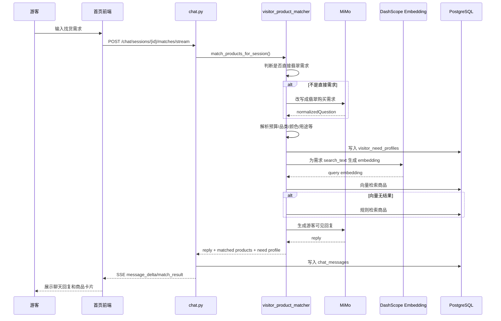
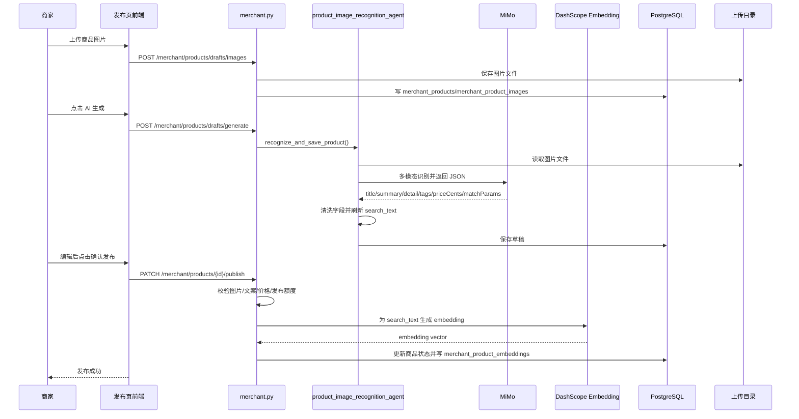
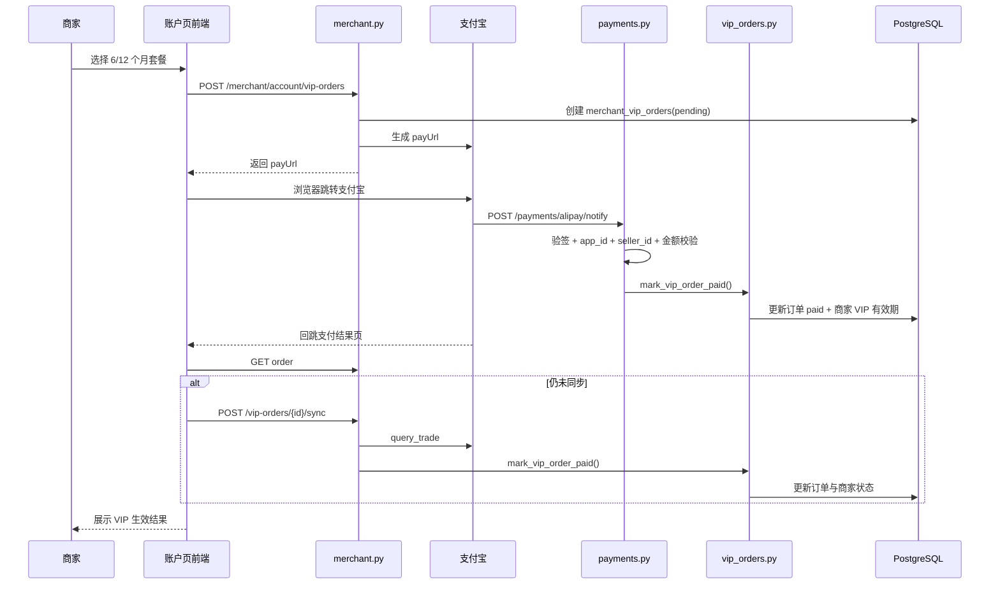

# 高翠网关键业务分析报告

更新时间：2026-06-16

本文只聚焦 3 条最关键的业务主链：

1. 买家找货流程
2. 商家发布商品流程
3. 商家升级/续费 VIP 支付流程

目标不是泛泛介绍页面，而是把这 3 条链路按“前端如何发起、后端如何处理、AI/向量服务如何参与、数据库如何落库、结果如何回到页面”完整串起来。

---

## 1. 整体业务关系

这 3 条链路不是孤立的，而是一个闭环：

1. 商家先发布商品
2. 商品发布成功后生成 `search_text` 和 `embedding`
3. 买家在首页发需求时，系统用这些已上架商品做匹配
4. 买家点进商品详情并留邮箱，系统生成 `merchant_leads` 和 `merchant_notifications`
5. 商家想查看完整客资、提升商品额度和匹配权重，就去购买 VIP
6. VIP 生效后，发布额度、客资查看权限、匹配排序权重一起变化

所以从业务本质上看：

- 商品发布链路负责“供给侧建库”
- 买家找货链路负责“需求侧匹配”
- VIP 支付链路负责“商家权益升级”

---

## 2. 核心数据对象

这 3 条主链路围绕以下表在运转：

- `chat_sessions`：首页游客聊天会话
- `chat_messages`：首页聊天消息，包含 AI 回复和匹配商品卡片
- `visitor_need_profiles`：把游客自然语言需求抽成结构化画像后落库
- `merchant_products`：商家商品主表
- `merchant_product_images`：商品图片表
- `merchant_product_embeddings`：商品向量表
- `merchant_leads`：买家留资表
- `merchant_notifications`：商家通知表
- `merchant_vip_orders`：VIP 订单表

对应模型文件：

- `FZ-backend/app/models/chat.py`
- `FZ-backend/app/models/product.py`
- `FZ-backend/app/models/lead.py`
- `FZ-backend/app/models/payment.py`

---

## 3. 买家找货流程

## 3.1 业务目标

让游客在首页直接说一句自然语言需求，系统自动：

1. 判断他是不是在明确找翡翠
2. 必要时把原话改写成翡翠购买需求
3. 抽取预算、品类、颜色、种水、器型、用途等信息
4. 用向量检索 + 规则检索找到候选商品
5. 生成面向游客的自然语言回复
6. 在聊天中展示商品卡片
7. 买家点商品详情后可以留邮箱，形成商家客资

---

## 3.2 前端入口

首页入口在：

- `FZ-front/src/pages/HomePage.tsx`

关键实现点：

1. 页面首次进入时，会从 `localStorage` 恢复 `visitorId`、`sessionId` 和历史消息。
2. 如果已有 `sessionId`，会请求 `/api/chat/sessions/{sessionId}/messages` 同步后端消息。
3. 用户点击建议词或手动发送时，前端先本地插入一条用户消息和一条空 assistant 占位消息，再发起流式匹配请求。
4. 真正调用的是：
   `POST /api/chat/sessions/{sessionId}/matches/stream`
5. 后端以 SSE 持续回传：
   - `message_delta`
   - `match_result`
   - `done`
6. 前端把 `message_delta` 不断拼到 assistant 占位消息上，最后再用 `match_result` 把临时消息替换为后端正式消息。

这部分代码位置：

- 会话恢复与消息同步：`FZ-front/src/pages/HomePage.tsx:153-230`
- 发送消息与流式处理：`FZ-front/src/pages/HomePage.tsx:232-298`
- 商品卡片渲染与跳详情：`FZ-front/src/pages/HomePage.tsx:385-432`

### 这条链路前端现在的关键修复

首页消息现在是“先本地显示，再等后端结果覆盖”，所以不会再出现“发送后要刷新才看到自己消息”的问题。

---

## 3.3 后端 API 入口

买家找货核心接口在：

- `FZ-backend/app/api/routes/chat.py`

关键接口：

1. `POST /api/chat/sessions`
   - 新建游客会话
2. `GET /api/chat/sessions/{session_id}/messages`
   - 拉取历史消息
3. `POST /api/chat/sessions/{session_id}/matches`
   - 非流式匹配
4. `POST /api/chat/sessions/{session_id}/matches/stream`
   - 流式匹配

核心逻辑：

1. 先校验会话存在。
2. 调 `match_products_for_session(...)`。
3. 拿到匹配结果后，写入一对消息：
   - 一条 `user`
   - 一条 `assistant`
4. `assistant` 消息里会额外挂：
   - `matched_products`
   - `need_profile_id`
5. 流式接口会把最终回复按 8 个字符一段切块后通过 SSE 返回。

关键代码位置：

- 消息保存：`FZ-backend/app/api/routes/chat.py:96-121`
- 创建会话：`FZ-backend/app/api/routes/chat.py:124-131`
- 流式匹配：`FZ-backend/app/api/routes/chat.py:206-239`

---

## 3.4 真正的匹配核心：visitor_product_matcher

核心服务：

- `FZ-backend/app/services/visitor_product_matcher.py`

这是买家找货的中枢服务。

### 第一步：判断是不是“直接翡翠需求”

系统会先调用 `looks_like_product_need(...)` 判断用户是不是本来就在找翡翠。

判断依据不是只看“翡翠”两个字，而是综合看：

- 是否有预算
- 是否出现品类词
- 是否出现颜色、种水、器型、瑕疵、用途、证书等特征
- 是否出现“找、想要、推荐、预算、购买”等意图词

代码位置：

- `FZ-backend/app/services/visitor_product_matcher.py:338-359`

### 第二步：必要时改写需求

如果用户原话不是标准翡翠求购语句，例如：

- “送妈妈生日礼物”
- “想找上班日常搭配的”
- “预算不高但要显气质”

系统会走 `VisitorNeedRewriteAgent.rewrite(...)`，让 MiMo 把它改写成“翡翠购物需求问题”。

这个改写 Agent 的约束非常明确：

- 只输出 JSON
- 不能拒绝
- 必须联想到送礼、日常佩戴、收藏、预算等翡翠选购场景

代码位置：

- 改写 Agent：`FZ-backend/app/services/visitor_product_matcher.py:144-168`

### 第三步：把自然语言解析成结构化需求

系统调用 `parse_visitor_need(...)` 提取：

- `budget_cents`
- `category`
- `colors`
- `waters`
- `shapes`
- `flaws`
- `purposes`
- `certificates`
- `keywords`
- `search_text`

其中预算解析支持：

- `2万`
- `1.5w`
- `三万`
- `5000元`

代码位置：

- 需求解析主入口：`FZ-backend/app/services/visitor_product_matcher.py:300-335`
- 预算解析：`FZ-backend/app/services/visitor_product_matcher.py:690-731`
- 品类/关键词抽取：`FZ-backend/app/services/visitor_product_matcher.py:734-799`

### 第四步：生成结构化画像并落库

系统会把这次需求组织成完整画像，生成：

- `title`
- `summary`
- `detail`
- `tags`
- `params`
- `search_text`

然后写入 `visitor_need_profiles` 表。

这一步的意义：

1. 把用户需求沉淀成可检索的结构化数据
2. 让 `assistant` 消息能绑定这次需求画像
3. 为后续分析真实买家需求提供基础

代码位置：

- 画像构建：`FZ-backend/app/services/visitor_product_matcher.py:399-642`
- 落库：`FZ-backend/app/services/visitor_product_matcher.py:261-274`
- 表结构：`FZ-backend/app/models/chat.py:32-55`

### 第五步：向量检索优先

系统优先走 `_vector_candidates(...)`：

1. 把需求 `search_text` 送去生成 embedding
2. 用 `merchant_product_embeddings.embedding.cosine_distance(...)` 做余弦距离查询
3. 只查 `status == "listed"` 的已上架商品
4. 若用户识别出品类，会先加品类过滤
5. 默认取前 `50` 个候选

代码位置：

- 向量候选：`FZ-backend/app/services/visitor_product_matcher.py:802-829`
- 查询需求 embedding：`FZ-backend/app/services/visitor_product_matcher.py:832-840`

### 第六步：向量失败时回退规则检索

如果向量失败或没有候选，就走 `_rule_candidates(...)`：

1. 从已上架商品里查最近更新的商品
2. 按关键词对以下字段做 `ilike`：
   - `title`
   - `summary`
   - `detail`
   - `search_text`
3. 如果还没有结果，放宽到“只按品类”
4. 再没有结果，就退化成“最近更新的已上架商品”

代码位置：

- 规则候选：`FZ-backend/app/services/visitor_product_matcher.py:843-898`

### 第七步：候选商品排序

候选出来后不会直接返回，而是做二次评分 `_score_candidate(...)`。

评分因素包括：

- 向量距离
- 颜色/种水/器型/瑕疵/用途命中
- 关键词命中
- 价格接近度
- 商家是否 VIP
- 商品更新时间

这意味着：

- 同样相关的商品，VIP 商家会有少量加分
- 最近更新的商品会更容易被排到前面
- 价格明显高于预算的商品会被扣分

代码位置：

- 排序评分：`FZ-backend/app/services/visitor_product_matcher.py:940-966`

### 第八步：生成游客可见回复

系统不会把内部的结构化标签直接返回给用户，而是再走一次 `VisitorNeedVisibleReplyAgent.generate(...)`：

1. 结合用户原话
2. 结合改写后的需求
3. 结合是否有匹配商品
4. 生成自然语言回复

这个回复被要求：

- 不能暴露内部匹配规则
- 不能输出思考过程
- 必须以“您好！我是高翠AI，很高兴为您服务。”开头

如果 MiMo 失败，则走模板兜底文案。

代码位置：

- 可见回复 Agent：`FZ-backend/app/services/visitor_product_matcher.py:171-232`
- 兜底文案：`FZ-backend/app/services/visitor_product_matcher.py:512-555`

---

## 3.5 买家点击商品详情并留资

匹配结果返回后，前端商品卡片点击会跳到：

- `/products/:id`

商品详情页在：

- `FZ-front/src/pages/ProductDetailPage.tsx`

详情页会：

1. 请求 `GET /api/products/{id}`
2. 展示商品图片、标题、价格、标签、AI简介、AI详情
3. 买家填写邮箱
4. 提交 `POST /api/products/{id}/contact`

代码位置：

- 详情页加载：`FZ-front/src/pages/ProductDetailPage.tsx:39-49`
- 留资提交：`FZ-front/src/pages/ProductDetailPage.tsx:51-71`

对应后端在：

- `FZ-backend/app/api/routes/products.py`

留资接口逻辑：

1. 先校验商品存在且已上架
2. 用 `product_id + buyer_email` 查重
3. 如果已留资，直接返回“已提交过联系意向”
4. 如果未留资：
   - 创建 `MerchantLead`
   - 创建 `MerchantNotification`
5. 一次 `commit`

代码位置：

- 商品详情：`FZ-backend/app/api/routes/products.py:60-63`
- 留资创建：`FZ-backend/app/api/routes/products.py:66-118`
- 客资表：`FZ-backend/app/models/lead.py:11-38`
- 通知表：`FZ-backend/app/models/lead.py:41-53`

### 这一段和商家侧如何串起来

买家一旦留资：

- 商家后台仪表盘的最近客资会出现
- 商家客资列表会出现
- 商家通知页会出现 `new_lead`
- 免费商家只能看到脱敏邮箱
- VIP 商家可以看到完整邮箱

---

## 3.6 买家找货流程时序图

---

## 4. 商家发布商品流程

## 4.1 业务目标

让商家在手机端或后台完成一条“上传图片 -> AI 生成文案 -> 商家确认/编辑 -> 发布上架”的闭环。

系统不是“AI 一键直接发”，而是“AI 先生成草稿，商家再确认发布”。

---

## 4.2 前端入口

发布页在：

- `FZ-front/src/pages/MerchantPublishPage.tsx`

页面流程分成四步：

1. 上传商品图片
2. AI 智能生成
3. 编辑商品信息
4. 提交发布

前端关键动作：

1. 页面加载时请求 `/api/merchant/products/current-draft`
2. 上传图片时请求 `/api/merchant/products/drafts/images`
3. 点击 AI 生成时请求 `/api/merchant/products/drafts/generate`
4. 点击确认发布时请求 `/api/merchant/products/{id}/publish`

代码位置：

- 草稿加载：`FZ-front/src/pages/MerchantPublishPage.tsx:51-81`
- 图片上传：`FZ-front/src/pages/MerchantPublishPage.tsx:88-130`
- AI 生成：`FZ-front/src/pages/MerchantPublishPage.tsx:146-181`
- 发布：`FZ-front/src/pages/MerchantPublishPage.tsx:183-204`
- 发布前前端校验：`FZ-front/src/pages/MerchantPublishPage.tsx:206-356`

---

## 4.3 后端发布流程入口

后端接口在：

- `FZ-backend/app/api/routes/merchant.py`

相关接口：

1. `GET /merchant/products/current-draft`
2. `POST /merchant/products/drafts/images`
3. `POST /merchant/products/drafts/generate`
4. `PATCH /merchant/products/{product_id}/publish`
5. `PATCH /merchant/products/{product_id}`
6. `PATCH /merchant/products/{product_id}/status`

---

## 4.4 第一步：获取当前发布草稿

`current_product_draft(...)` 的作用不是拿任意 draft，而是取“最近一个仍属于发布流程中的 draft”。

判断条件在 `_is_publish_flow_draft(...)`：

- 有上传图片
- 或者虽然字段是空的，但仍是上传流程产生的空白草稿

这样做的意义：

- 商家重新进发布页时，能接上上次没发完的商品
- 不是把所有草稿都混在一起

代码位置：

- 获取当前 draft：`FZ-backend/app/api/routes/merchant.py:852-869`
- 发布流程草稿判断：`FZ-backend/app/api/routes/merchant.py:321-357`

---

## 4.5 第二步：上传商品图片

商家上传图片走：

- `POST /merchant/products/drafts/images`

后端处理流程：

1. 校验必须有图片
2. 如果前端传了 `productId`，就接着已有 draft 继续传
3. 如果没传，就取当前最新发布 draft
4. 校验总图数不能超过 6 张
5. 如果还没有草稿，就创建一个新的 `merchant_products` 记录，状态为 `draft`
6. 如果已经有 draft，就先清空标题、简介、详情、标签、价格
   - 因为图片变化后，旧 AI 文案不再可信
7. 每张图片都保存为物理文件，并写入 `merchant_product_images`
8. 同步更新 `product.image_urls`

物理路径规则：

- 存储 key：`merchants/{merchant_id}/products/{product_id}/{image_id}.jpg`
- 公网路径：`/uploads/{storage_key}`

代码位置：

- 上传接口：`FZ-backend/app/api/routes/merchant.py:872-938`
- 图片保存：`FZ-backend/app/api/routes/merchant.py:453-475`
- 商品图片表：`FZ-backend/app/models/product.py:39-59`

---

## 4.6 第三步：AI 识别商品图片生成草稿

接口：

- `POST /merchant/products/drafts/generate`

后端接口本身的职责：

1. 找到当前商品 draft
2. 如果本次还有新图片，一并先落库
3. 聚合旧图 + 新图的完整图片列表
4. 调 `product_image_recognition_agent.recognize_and_save_product(...)`

代码位置：

- 生成接口：`FZ-backend/app/api/routes/merchant.py:941-1013`

### 图片识别 Agent 的真实工作流程

服务文件：

- `FZ-backend/app/services/product_image_recognition_agent.py`

内部步骤如下：

1. 把每张 `/uploads/...` 图片路径转成真正的本地文件路径
2. 读取文件内容
3. 转成 `base64 data URL`
4. 组织多模态请求，调用 MiMo 的 `chat/completions`
5. 要求只返回 JSON，字段必须包含：
   - `title`
   - `summary`
   - `detail`
   - `tags`
   - `priceCents`
   - `matchParams`
6. 解析 JSON
7. 清洗结果：
   - 标题截到 10 字
   - 简介截到 50 字
   - 详情截到 300 字
   - 标签最多 10 个
   - `matchParams` 统一补全标准字段
8. 价格如果 AI 返回异常或小于等于 0，会按品类做兜底估价
9. 写回 `merchant_products`
10. 同步刷新 `search_text`
11. `commit`

代码位置：

- 识别并写库：`FZ-backend/app/services/product_image_recognition_agent.py:58-83`
- 调 MiMo 多模态：`FZ-backend/app/services/product_image_recognition_agent.py:85-126`
- 解析和清洗 JSON：`FZ-backend/app/services/product_image_recognition_agent.py:128-167`
- 价格兜底：`FZ-backend/app/services/product_image_recognition_agent.py:169-207`
- 图片转 data URL：`FZ-backend/app/services/product_image_recognition_agent.py:220-255`

### 为什么它不是“直接发布”

因为 AI 只负责生成草稿字段，不负责改商品状态。

AI 生成后，商品仍然是：

- `status = "draft"`

商家还必须：

1. 查看 AI 结果
2. 手工确认或编辑
3. 再点击“确认发布”

这和真实业务是匹配的，能防止 AI 直接把错误内容上架。

---

## 4.7 第四步：统一生成 search_text

AI 生成完商品文案后，系统不会直接只拿标题去做搜索。

它会在：

- `FZ-backend/app/services/product_search.py`

把以下内容拼成统一搜索文本：

- 标题
- 简介
- 详情
- 标签
- 价格
- 标准化后的 `match_params`

这段 `search_text` 后续用于：

1. 商品 embedding
2. 买家规则匹配
3. 买家向量匹配的语义来源

代码位置：

- 参数标准化：`FZ-backend/app/services/product_search.py:32-38`
- 生成搜索文本：`FZ-backend/app/services/product_search.py:41-65`
- 写回商品：`FZ-backend/app/services/product_search.py:68-77`

---

## 4.8 第五步：商家确认发布

商家点击确认发布后，请求：

- `PATCH /merchant/products/{product_id}/publish`

后端执行步骤：

1. 取到该商家的商品
2. 用前端提交内容覆盖 AI 草稿
3. 调 `_assert_product_ready_to_publish(...)` 做校验：
   - 必须有图
   - 标题/简介/详情不能为空
   - 价格必须大于 0
4. 如果当前商品还不是已上架状态，则检查额度
   - 免费商家上限 2 件
   - VIP 商家上限 100 件
5. 设置：
   - `status = "listed"`
   - `published_at = now`
6. 调 `_refresh_product_embedding(...)`
7. 生成或刷新商品 embedding
8. 提交事务

代码位置：

- 发布接口：`FZ-backend/app/api/routes/merchant.py:1032-1057`
- 发布完整性校验：`FZ-backend/app/api/routes/merchant.py:432-440`
- 发布额度校验：`FZ-backend/app/api/routes/merchant.py:492-517`
- 商品 embedding 刷新：`FZ-backend/app/api/routes/merchant.py:144-186`

---

## 4.9 第六步：生成商品 embedding

商品 embedding 服务在：

- `FZ-backend/app/services/embeddings.py`

流程：

1. 用 DashScope 的 embeddings 接口生成向量
2. 输入文本不是商品标题，而是 `search_text`
3. 返回向量后写入 `merchant_product_embeddings`
4. 同时记录：
   - provider
   - model
   - dimensions
   - content_hash

`content_hash` 的作用是：

- 如果 `search_text` 没变化，就不重复刷新 embedding

代码位置：

- Embedding 调用：`FZ-backend/app/services/embeddings.py:20-63`
- 商品 embedding 表：`FZ-backend/app/models/product.py:62-91`

---

## 4.10 商家发布流程时序图

---

## 5. 商家升级/续费 VIP 支付流程

## 5.1 业务目标

让商家在“账户权限”页：

1. 看到当前权限
2. 选择 6 个月或 12 个月套餐
3. 发起支付宝支付
4. 支付成功后自动生效 VIP 权益
5. 生效后影响：
   - 商品发布额度
   - 客资查看权限
   - 匹配排序中的商家加权

---

## 5.2 前端入口

账户页：

- `FZ-front/src/pages/MerchantAccountPage.tsx`

核心逻辑：

1. 先请求 `/api/merchant/account`
2. 后端返回：
   - 当前商家 tier
   - 已发布数量
   - 今日发布数量
   - 客资查看权限
   - 优先展示权重
   - VIP 套餐列表
3. 商家选择套餐后，点击按钮
4. 前端请求：
   `POST /api/merchant/account/vip-orders`
5. 后端返回 `payUrl`
6. 前端直接：
   `window.location.assign(payUrl)`

代码位置：

- 页面加载与账户信息：`FZ-front/src/pages/MerchantAccountPage.tsx:46-67`
- 发起支付：`FZ-front/src/pages/MerchantAccountPage.tsx:69-99`

---

## 5.3 后端创建 VIP 订单

后端入口在：

- `FZ-backend/app/api/routes/merchant.py`

创建订单接口：

- `POST /merchant/account/vip-orders`

执行步骤：

1. 校验商家登录态
2. 通过 `vip_amount_cents(plan_months)` 计算套餐金额
3. 生成平台订单号 `VIP{时间戳}{随机串}`
4. 创建 `merchant_vip_orders`
5. 根据 `pay_channel` 选择：
   - `create_wap_pay_url`
   - `create_page_pay_url`
6. 给支付宝传：
   - 平台订单号
   - 金额
   - 订单标题
   - 异步通知地址 `notify_url`
   - 同步回跳地址 `return_url`
7. `commit`
8. 返回订单信息和支付链接

代码位置：

- 账户接口：`FZ-backend/app/api/routes/merchant.py:586-594`
- 创建订单：`FZ-backend/app/api/routes/merchant.py:597-648`
- 套餐与金额：`FZ-backend/app/services/vip_orders.py:13-48`

---

## 5.4 支付宝回调如何生效

异步回调入口在：

- `FZ-backend/app/api/routes/payments.py`

回调流程：

1. 接收支付宝 form 参数
2. 调 `alipay_client.verify_notification(...)` 验签
3. 校验 `app_id`
4. 校验 `seller_id`
5. 根据支付宝回传的 `out_trade_no` 查平台订单
6. 校验支付宝金额与平台订单金额一致
7. 如果 `trade_status == TRADE_SUCCESS`
   - 调 `mark_vip_order_paid(...)`
   - 更新订单状态为 `paid`
   - 更新商家 `tier = vip`
   - 更新 `vip_started_at / vip_expires_at`
8. 如果 `trade_status == TRADE_CLOSED`
   - 调 `mark_vip_order_closed(...)`

代码位置：

- 回调接口：`FZ-backend/app/api/routes/payments.py:24-70`

---

## 5.5 VIP 生效规则

VIP 生效不是简单把商家状态改成 `vip`，还有续费衔接逻辑。

逻辑在：

- `FZ-backend/app/services/vip_orders.py`

`mark_vip_order_paid(...)` 的规则：

1. 用 `with_for_update()` 锁订单，避免并发重复处理
2. 如果订单已经 `paid`，直接返回，保证幂等
3. 判断商家当前是否仍在有效 VIP 期内
4. 如果还在 VIP 有效期内：
   - 新套餐从“当前过期时间”往后顺延
5. 如果已不是有效 VIP：
   - 新套餐从 `paid_at` 开始
6. 更新：
   - `merchant.tier`
   - `merchant.vip_started_at`
   - `merchant.vip_expires_at`
   - `order.paid_at`
   - `order.grant_started_at`
   - `order.grant_expires_at`

代码位置：

- 生效与续费顺延：`FZ-backend/app/services/vip_orders.py:58-95`
- 关闭订单：`FZ-backend/app/services/vip_orders.py:98-116`

---

## 5.6 前端支付结果页如何兜底同步

即使支付宝异步回调延迟，前端也不会只依赖回调。

支付结果页在：

- `FZ-front/src/pages/MerchantAccountPaymentResultPage.tsx`

页面逻辑：

1. 从 URL 里拿 `order_id`
2. 先请求：
   `GET /api/merchant/account/vip-orders/{order_id}`
3. 如果状态已是 `paid`，直接成功
4. 如果还是 `pending`，前端轮询最多 4 次：
   `POST /api/merchant/account/vip-orders/{order_id}/sync`
5. `sync` 接口会主动去支付宝查单
6. 如果查到成功，就走同样的 `mark_vip_order_paid(...)`
7. 前端成功后再请求 `/api/auth/me` 刷新本地商家身份

代码位置：

- 结果页逻辑：`FZ-front/src/pages/MerchantAccountPaymentResultPage.tsx:26-105`
- 订单详情：`FZ-backend/app/api/routes/merchant.py:651-671`
- 主动查单同步：`FZ-backend/app/api/routes/merchant.py:674-740`

这意味着支付链路有双保险：

1. 支付宝异步通知
2. 前端回跳后的主动查单同步

---

## 5.7 VIP 权益如何影响其他业务

VIP 生效后，至少影响以下 3 个地方：

### 1. 商品发布额度

- 免费商家：2 件
- VIP 商家：100 件

代码位置：

- `FZ-backend/app/api/routes/merchant.py:188-190`

### 2. 客资查看权限

- 免费商家：看到脱敏邮箱 `****@***.com`
- VIP 商家：看到完整邮箱

代码位置：

- 邮箱脱敏：`FZ-backend/app/api/routes/merchant.py:120-130`

### 3. 买家匹配时排序加权

匹配打分时，VIP 商家商品有额外加分。

代码位置：

- `FZ-backend/app/services/visitor_product_matcher.py:957-959`

---

## 5.8 VIP 支付流程时序图

---

## 6. 三条业务链如何真正连起来

这一部分是整个项目最关键的业务闭环。

## 6.1 从“商家发布”到“买家找货”

商家发布成功后，商品会产生两层用于匹配的能力：

1. `search_text`
2. `embedding`

后续买家在首页说需求时：

1. 需求也会被组装成 `search_text`
2. 系统先把需求转 embedding
3. 再和 `merchant_product_embeddings` 做相似度检索

所以买家侧匹配能力，本质上依赖商家发布链路是否把商品语义描述构建完整。

如果商家商品只写了一个很弱的标题、没图、没标签、没详情，那么：

- 向量质量会差
- 规则匹配命中也会差

换句话说，商家发布质量直接决定买家匹配质量。

## 6.2 从“买家找货”到“商家客资”

买家聊天阶段并不会立刻形成客资。

真正形成客资的节点是：

1. 买家看到了匹配商品
2. 进入商品详情
3. 主动填写邮箱并提交

系统才会写：

- `merchant_leads`
- `merchant_notifications`

所以这套设计把“浏览兴趣”和“明确意向”区分开了，避免一条聊天就产生无效客资。

## 6.3 从“VIP 支付”反向影响前两条链路

VIP 支付不是孤立的财务功能，而是业务权重控制器。

它会反向影响：

### 对商家发布链路的影响

- 免费商家只能最多上架 2 件
- VIP 商家最多可上架 100 件

### 对买家匹配链路的影响

- VIP 商品在排序里有加分
- 所以更容易被买家优先看到

### 对客资转化链路的影响

- 免费商家虽然能收到 lead 记录和通知
- 但看不到真实邮箱
- VIP 商家可以看到完整邮箱并跟进

也就是说，VIP 不是只卖“身份标签”，而是在供给量、曝光权重、转化权限三个层面一起生效。

---

## 7. 当前实现中的关键特点与风险点

下面这部分不是流程本身，而是结合代码看到的几个关键实现特点和潜在风险。

## 7.1 特点：买家匹配做了“双层 AI + 双层检索”

这套买家链路不是只做一次大模型对话，而是：

1. 先做需求改写
2. 再做最终可见回复
3. 中间用向量检索
4. 最后规则检索兜底

优点是接话能力强，比较适合真实用户的松散表达。

## 7.2 特点：商品不是“AI 自动发”，而是“AI 生成草稿后人工确认”

这比较符合真实商家业务，能降低错误上架风险。

## 7.3 特点：VIP 生效做了“回调 + 主动查单”双保险

这使得宝塔普通部署模式下，只要公网回调或前端回跳有一条成功，VIP 大概率能最终同步成功。

## 7.4 风险：商品发布强依赖 embedding 成功

发布接口会在上架前调用 `_refresh_product_embedding(...)`。

这意味着如果 DashScope embedding 服务异常、超时、配置错误：

- 商品会发布失败
- 即使商品文案已经完整，仍不能上架

这不是代码 bug，而是当前业务策略选择：宁可不发布，也不允许没有 embedding 的已上架商品进入匹配体系。

## 7.5 风险：流式匹配接口把异常字符串直接返回前端

`create_match_message_stream(...)` 在异常时直接：

- `yield error: {"message": str(error)}`

如果未来某些异常信息包含内部实现细节，可能会直接暴露给前端用户。

更稳的做法通常是：

- 日志里记录真实异常
- 对用户只返回统一友好文案

## 7.6 风险：公开商品详情仍保留默认 mock 图片兜底

公开商品接口在没有实际图片时，仍会退回：

- `"/mock-products/jade-1.png"`

这不是之前那种“自动灌入假商品”的问题，但它仍然属于静态兜底资源。

如果你希望线上所有公开数据都彻底不出现 mock 痕迹，后续可以把这类默认图片兜底也替换成真实平台占位图。

## 7.7 风险：商品图片一旦变化，会清空旧 AI 文案

这其实是故意设计，不是 bug。

因为图片一变，旧标题、旧简介、旧价格可能已经失真，所以后端上传图片接口会把：

- `title`
- `summary`
- `detail`
- `tags`
- `price_cents`

重置掉，要求重新生成。

这样更安全，但商家体验上要接受“换图即重生成”。

---

## 8. 结论

这三个业务的真实关系可以概括为一句话：

商家发布商品建立可匹配货源库，买家找货链路从货源库中做 AI 匹配并转成客资，VIP 支付再反过来影响商家的发布能力、曝光权重和客资获取权限。

从代码实现上看，这个项目的核心能力已经比较明确：

1. 买家侧不是普通聊天，而是“需求理解 + 商品匹配 + 转化留资”
2. 商家侧不是普通商品 CRUD，而是“AI 识图生成草稿 + 商家确认发布 + 向量入库”
3. 支付侧不是单纯收款，而是“支付成功后即时改写商家业务权限”

如果后续继续做业务增强，最值得继续深挖的点通常会是：

1. 提高买家匹配速度
2. 优化商品草稿生成质量
3. 完善 VIP 权益对曝光和转化的量化效果

